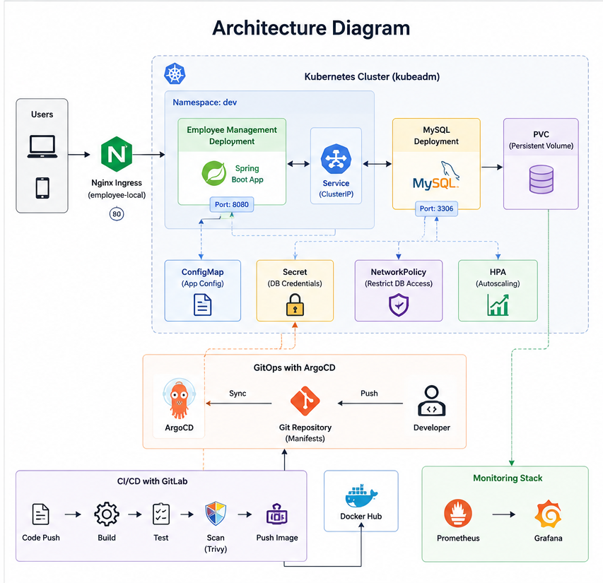
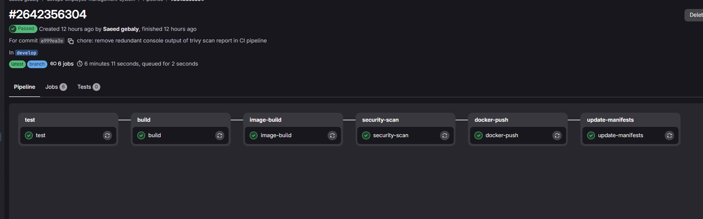
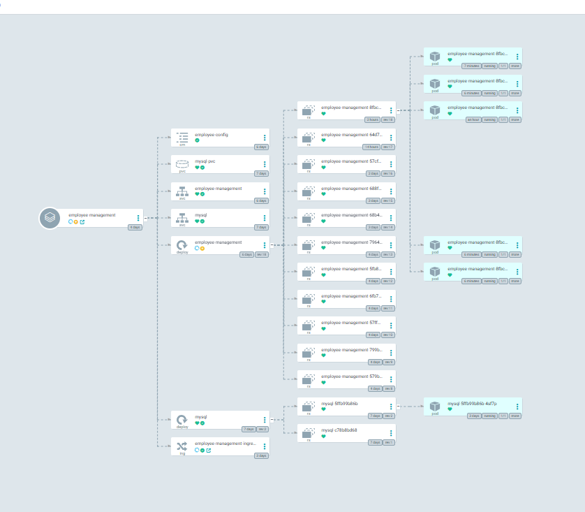
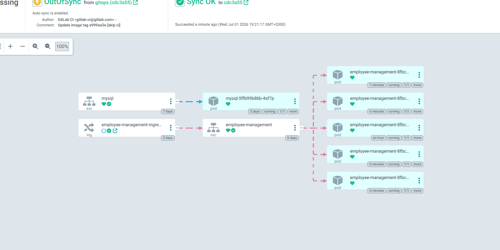
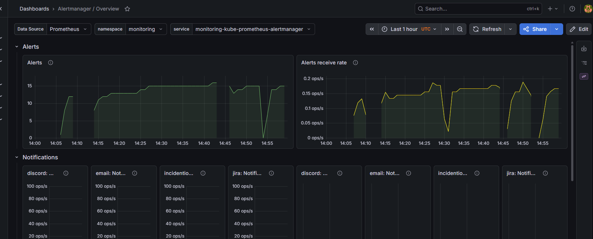

# Employee Management System

A production-style DevOps project demonstrating the deployment and management of a Spring Boot application on Kubernetes using GitOps practices, CI/CD automation, monitoring, autoscaling, security scanning, and persistent storage.

## Tech Stack

- Spring Boot
- MySQL
- Docker
- Kubernetes (kubeadm)
- GitLab CI/CD
- ArgoCD
- Prometheus
- Grafana
- Trivy
- Nginx Ingress Controller

## Features

- Employee CRUD API
- Validation
- Global Exception Handling
- Swagger UI
- Health Checks
- Metrics Endpoint
- Rolling Updates
- ConfigMaps & Secrets
- Persistent Volume Claims (PVC)
- Nginx Ingress
- Horizontal Pod Autoscaler (HPA)
- Network Policies
- GitOps Deployment with ArgoCD
- Container Security Scanning with Trivy
- Monitoring with Prometheus & Grafana

## Project Structure

devops-employee-management-system
├── app/
│   └── Spring Boot Application
├── docker/
│   └── Dockerfile
├── manifests/
│   ├── app/
│   └── mysql/
├── monitoring/
│   └── Prometheus & Grafana
├── docs/
│   ├── architecture-diagram.png
│   └── screenshots/
├── .gitlab-ci.yml
└── README.md

## Architecture

## CI/CD Pipeline

Developer
   ↓
GitLab Repository
   ↓
Build Stage
   ↓
Docker Image Build
   ↓
Trivy Security Scan
   ↓
Push Image to Docker Hub
   ↓
Update Kubernetes Manifests
   ↓
ArgoCD Sync
   ↓
Kubernetes Deployment

## Monitoring

The application is monitored using Prometheus and Grafana.
Metrics collected include:

- Pod CPU Usage
- Pod Memory Usage
- Node Resource Usage
- Application Health Status
- Kubernetes Cluster Metrics

## Kubernetes Features
- Deployment
- Service
- Ingress
- ConfigMap
- Secret
- PVC
- HPA
- NetworkPolicy
- Liveness Probe
- Readiness Probe

### ArgoCD Dashboard

### Grafana Dashboard

### Application

## Author

Saeed Gebaly

Cloud & DevOps Engineer

GitHub: https://github.com/saeedgebaly
LinkedIn: https://linkedin.com/in/saeedgebaly